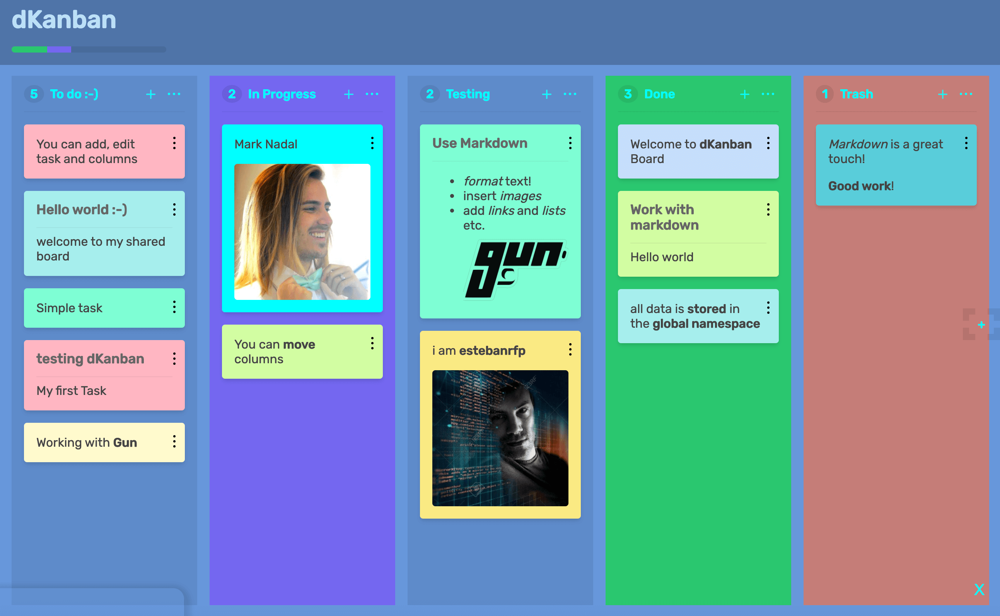

# dKanban Board

Distributed Kanban board that stores data in Gun

## Features
- Markdown
- Drag & Drop Cards and Columns
- Add, Edit, Remove Cards
- Add, Edit, Remove Columns

## Coming soon
Refactored components will be available soon

## ScreenShoot

[dKanban Demo](https://dkanban.com/) Powered by [GUN](https://gun.eco/)

-------------

#### Credits & Thanks
* [Mark's GUN](https://gun.eco/) and its community!

* [by estebanrfp](https://desarrolloactivo.com/)
