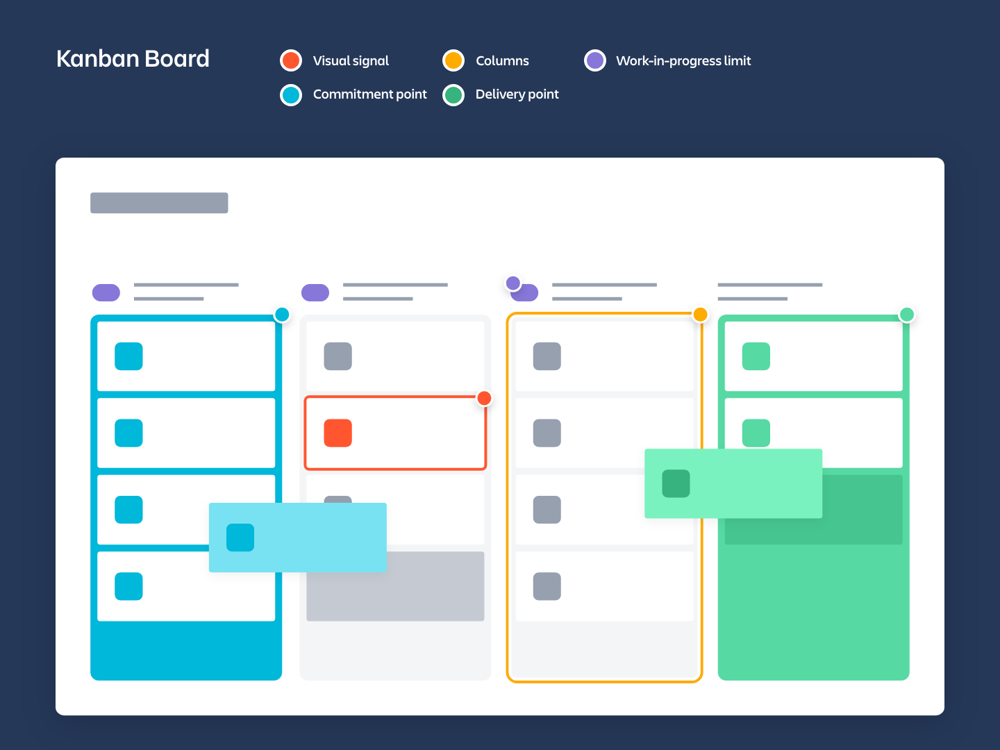

# dKanban Board

Distributed Kanban board on [GenosDB](https://github.com/estebanrfp/gdb) — your board is **yours, cryptographically**.

Every identity owns a personal board protected by node-level **ACLs**: only the owner (and the collaborators they explicitly grant) can write it, and every peer re-verifies that on every operation. **Governance** keeps the door honest — newcomers are read-only guests until the rules promote them to `user` (~10 s while a superadmin is online), so write access is earned, not free for throwaway identities.

## Features
- Personal board per identity, ACL-owned — nobody else can touch it
- **Share Access**: grant/revoke write to another address + shareable `#board=0x…` deep link
- Zero-trust roles (`guest` → `user`) promoted by the governance engine
- Identity modal as the door: mnemonic identity, passkey protection (WebAuthn via the Security Manager)
- Markdown cards, drag & drop cards and columns, live P2P sync

## Try it
1. Open the [demo](https://estebanrfp.github.io/dKanban/) — the identity dialog is the door.
2. Press **🛡️ Demo superadmin** in one browser (runs the governance engine).
3. Generate an identity in another browser: watch it earn `user` and get its own board.
4. **Share** your board with the other identity's address and edit it together.

## Screenshot

[dKanban Demo](https://estebanrfp.github.io/dKanban/) Powered by [GenosDB](https://github.com/estebanrfp/gdb)

-------------

## Author

Esteban Fuster Pozzi (@estebanrfp) - Full Stack JavaScript Developer
